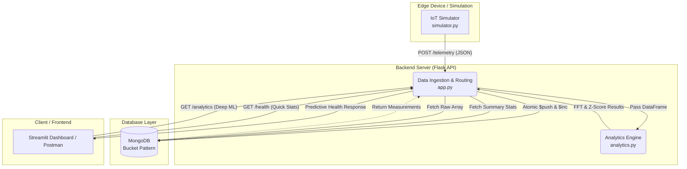

# Centralized Multi-Sensor Telemetry Engine (Bosch IIoT Case Study)

## Project Member
- Khalisa Zahra M (2406425395)
- Muhammad Rafif (2406408836)
- M Daffa Rizki (2406402050)
- Ferdyano (2406353723)
- Sakabudi M (2406429683)

## Project Description

Pada pabrik modern, mesin-mesin menggunakan berbagai jenis sensor (vibrasi, suhu, kelembapan) yang menghasilkan payload JSON dengan struktur berbeda-beda setiap detiknya. Database relasional (SQL) tradisional seringkali kewalahan menghadapi heterogenitas skema ini dan besarnya volume data *time-series* (menyebabkan *overhead index* dan *bottleneck I/O*).

Proyek ini menyelesaikan tantangan tersebut dengan mengimplementasikan **MongoDB Bucket Pattern**. Alih-alih menyimpan satu dokumen baru untuk setiap pembacaan sensor, sistem mengelompokkan data berfrekuensi tinggi ke dalam sebuah "bucket" berdasarkan rentang waktu tertentu (contoh: 5 menit per *bucket*). 

Sistem ini terbagi menjadi 4 code utama:

**1. IoT Edge Simulator (`simulator.py`)**
Program ini bertindak sebagai hardware yang mensimulasikan pembacaan sensor MPU-6050 (Vibrasi 3-Axis & Gyroscope) dan DHT22 (Suhu & Kelembapan). Program men- generate angka berdasarkan 3 fase siklus hidup mesin:
- **Fase Normal:** Mesin berjalan stabil
- **Fase Warning:** Mulai muncul noise pada getaran dan suhu perlahan naik
- **Fase Fault:** Getaran ekstrem dan *overheat* (simulasi kerusakan).
Data ini kemudian ditembakkan ke Backend API setiap 1 detik menggunakan HTTP POST

**2. API Gateway & Routing (`app.py`)**
Dibangun menggunakan framework Flask, program ini bekerja sebagai inteerface yang tugasnya menerima payload JSON dari simulator, memvalidasi apakah kolom datanya lengkap, dan merutekannya ke database. Program ini juga menyediakan *Endpoint REST API* (seperti `/health` dan `/analytics`) untuk UI Dashboard

**3. Database Access & Bucket Logic (`db.py`)**
Program ini menerapkan algoritma **Bucket Pattern**:
- Program mengecek apakah ada "Bucket" yang masih terbuka untuk motor tersebut
- Data setiap detik dipush ke dalam array menggunakan `$push` di MongoDB
- Saat isi bucket mencapai limit (300 data / 5 menit), program ini akan melakukan **Pre-Aggregation** untuk mencari nilai akar rata-rata kuadrat (RMS) vibrasi dan rata-rata suhu, menyimpannya di field `stats`, lalu menutup bucket tersebut

**4. Data Processing & Analytics Engine (`analytics.py`)**
Bagian ini bertugas menarik array dan mengubahnya menjadi **Pandas DataFrame**. Setelah itu akan execute algoritma saintifik:
- **Z-Score Anomaly Detection:** Mencari anomali / lonjakan suhu
- **Fast Fourier Transform (FFT):** Menggunakan library *SciPy* untuk menganalisa spektrum frekuensi getaran dari time-domain ke frequency-domain. Dari hasil FFT ini, algoritma dapat mendeteksi komponen apa yang rusak
- Menghitung **Predictive Health Score** akhir (0-100%) sebagai kesimpulan kondisi mesin

**Key Features:**
- **Schema Flexibility:** Mampu menerima struktur payload yang dinamis dari berbagai jenis sensor tanpa memerlukan downtime untuk `ALTER TABLE`.
- **High-Throughput Ingestion:**  Menggunakan operation MongoDB `$push` dan `$inc` untuk write yang cepat.
- **Pre-Aggregation:** Menghitung statistik dasar (RMS, rata-rata, nilai maksimum) di level database saat sebuah bucket ditutup, sehingga data siap di-query.
- **Analytics Engine:** Mngintegrasi library Pandas dan SciPy untuk mendeteksi anomali (Z-Score) dan Fast Fourier Transform (FFT) untuk mengidentifikasi secara spesifik komponen motor mana yang rusak (misal: Rotor, Stator, Bearing)

---

## Architecture Diagram


## How to run

### Prerequisites
- **Python 3.8** or latest
- **MongoDB** 

### Langkah-langkah Instalasi & Eksekusi

**1. Cloning repository**

**2. Instalasi Dependensi**
Masuk ke folder backend dan instal library Python yang dibutuhkan oleh sistem menggunakan `pip`:

```bash
cd bosch-motor-monitor/backend
pip install -r requirements.txt
```

**3. Konfigurasi Environment**
Buat sebuah file baru bernama `.env` didalam folder `backend/`. Buka file tersebut dan masukkan URI koneksi MongoDB:

```env
MONGO_URI="mongodb://localhost:27017/"
#Contoh
```

**4. Jalankan API Backend (Flask)**
Nyalakan server:

```bash
python app.py
```

**5. Jalankan IoT Simulator**
Buka window terminal baru pada directory `backend/`, lalu jalankan generator data sensor:

```bash
python simulator.py
```

**6. Jalankan Frontend Dashboard (Streamlit)**
Buka window terminal baru pada directory `frontend/` :

```bash
cd ../frontend
streamlit run dashboard.py
```
